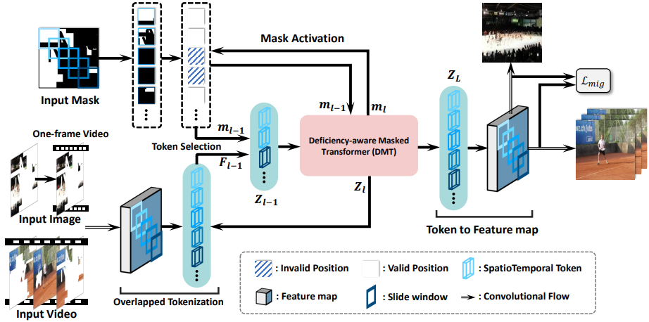
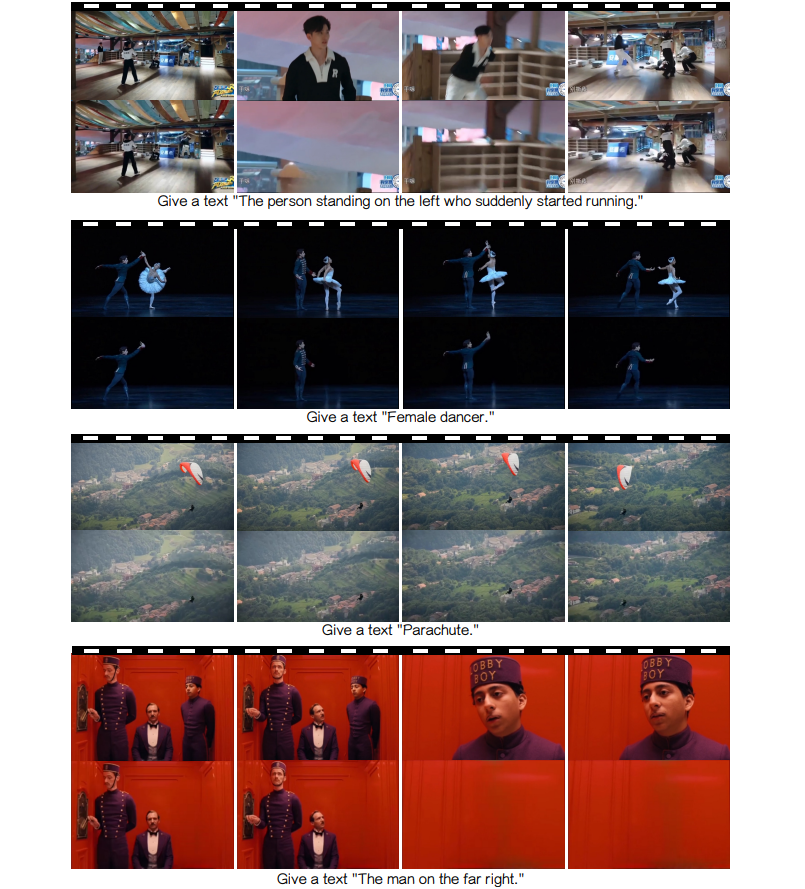
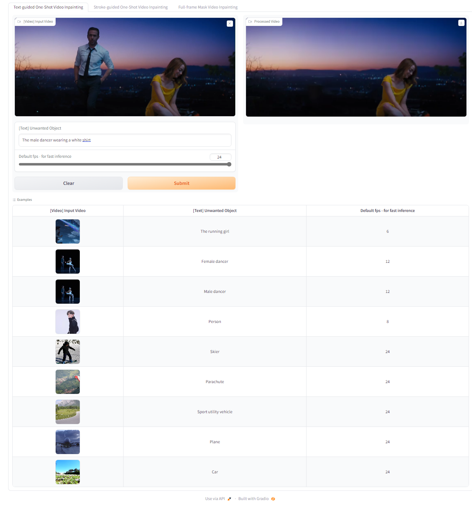
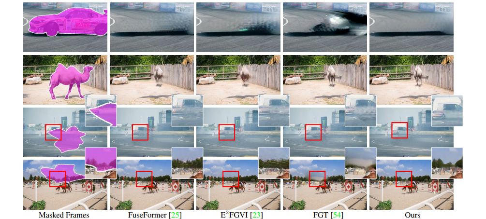

# DMT - Deficiency-Aware Masked Transformer for Video Inpainting

Welcome to the official code repository for [**Deficiency-Aware Masked Transformer for Video Inpainting**](https://arxiv.org/abs/2307.08629). We're excited to share our work with you, please bear with us as we prepare the video demonstration, code, and demo. Stay tuned for the reveal!

## Inpainting Pipeline

## Video Object Removal without Frame-wise Masks

## Demo

## Qualitative Comparisons

